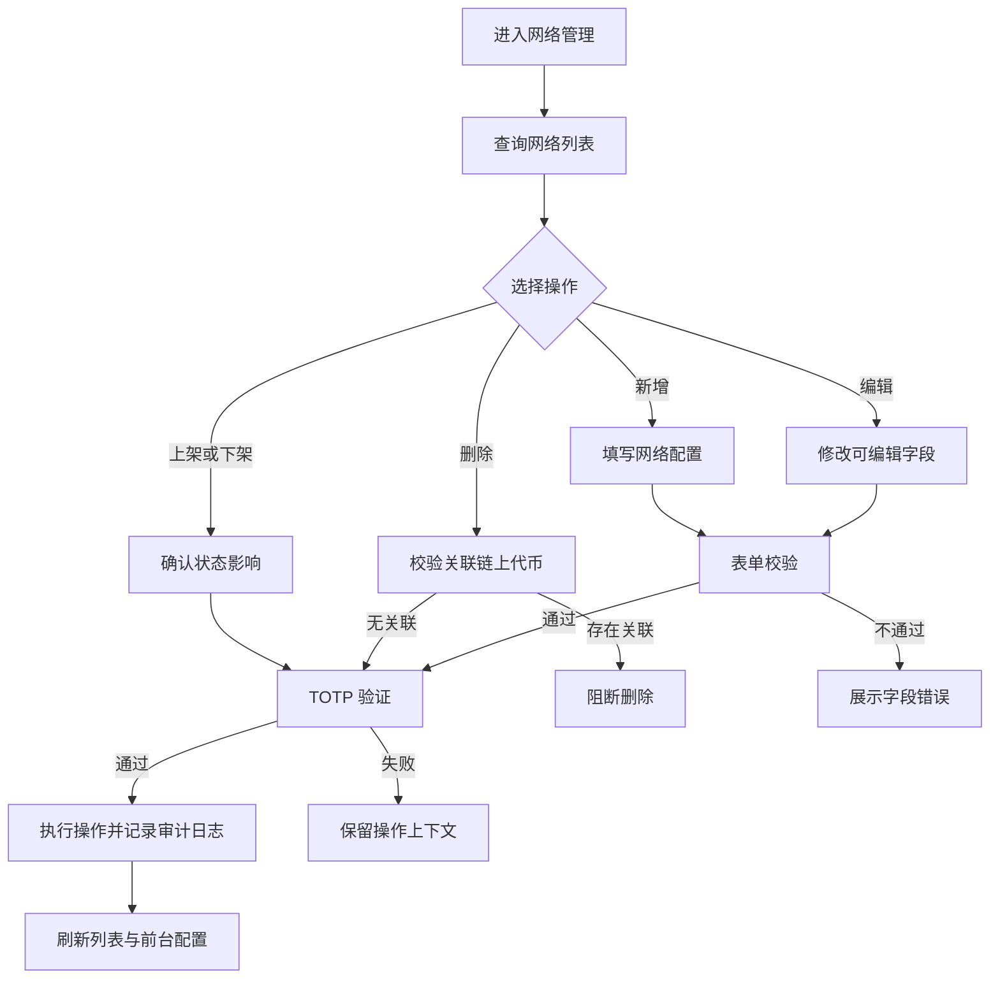
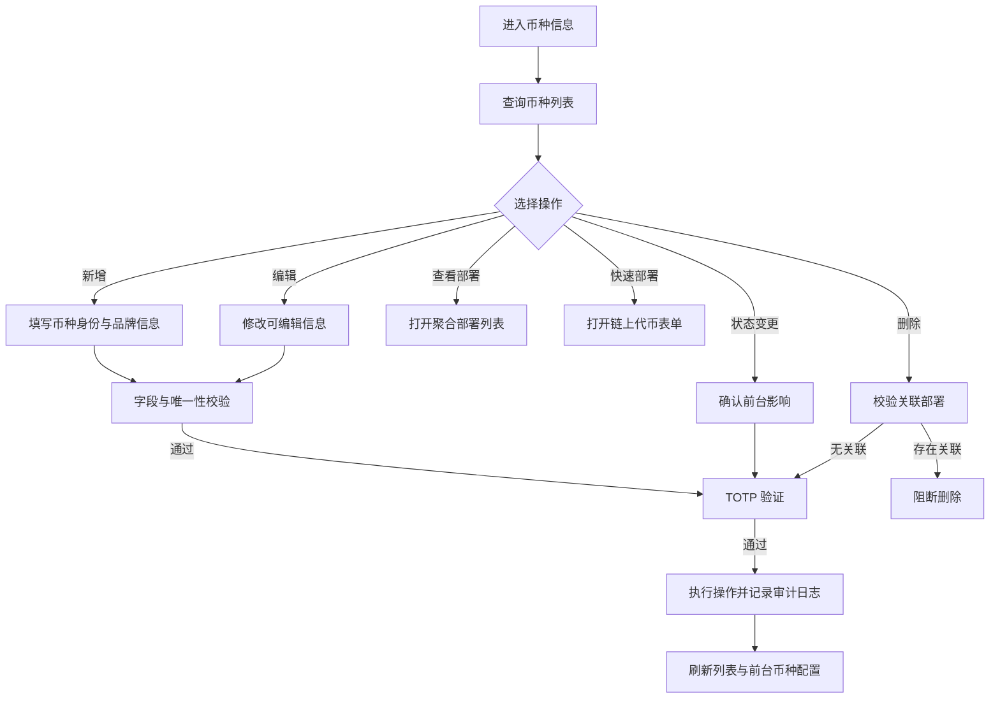
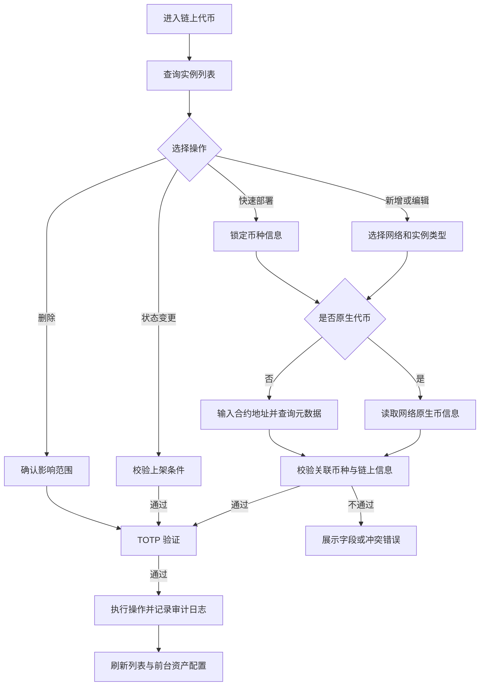
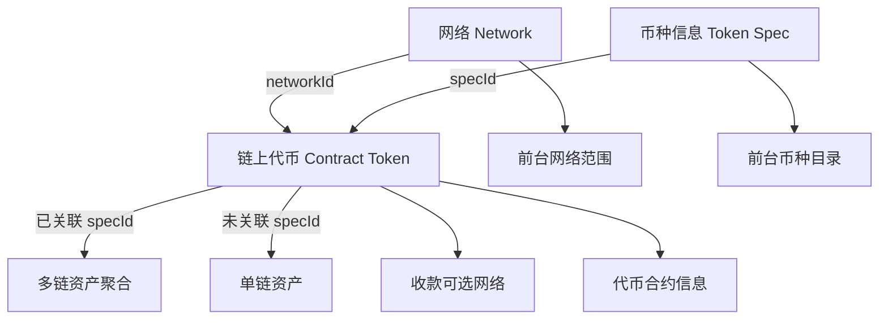

# Biya Web3 钱包 Admin 后台 · 网络与代币管理产品需求文档

## 文档说明

| 项目 | 内容 |
| --- | --- |
| 文档版本 | **V1.2.0** |
| 创建日期 | 2026-04-24 |
| 最后更新 | 2026-07-29 |
| 产品经理 | Terry |
| 产品名称 | BiyaPay Web3 钱包管理后台 |
| 文档定位 | 定义网络、币种信息与链上代币的后台管理能力及其前台生效规则 |
| 核心能力 | 网络管理 → 币种信息管理 → 链上代币管理 → 前台配置生效 |

---

## 目录

- [1. 本版交付摘要](#1-本版交付摘要)
  - [1.1 产品目标](#11-产品目标)
  - [1.2 核心数据模型](#12-核心数据模型)
  - [1.3 本版核心变化](#13-本版核心变化)
  - [1.4 本版交付能力](#14-本版交付能力)
- [2. 后台框架与安全](#2-后台框架与安全)
  - [2.1 模块说明](#21-模块说明)
  - [2.2 页面框架](#22-页面框架)
  - [2.3 通用交互规则](#23-通用交互规则)
  - [2.4 TOTP 安全验证](#24-totp-安全验证)
  - [2.5 全局页面状态](#25-全局页面状态)
- [3. 网络管理](#3-网络管理)
  - [3.1 用户目标](#31-用户目标)
  - [3.2 模块说明](#32-模块说明)
  - [3.3 流程步骤](#33-流程步骤)
  - [3.4 列表与筛选](#34-列表与筛选)
  - [3.5 新增与编辑](#35-新增与编辑)
  - [3.6 页面状态矩阵](#36-页面状态矩阵)
  - [3.7 交互规则](#37-交互规则)
  - [3.8 数据管理](#38-数据管理)
- [4. 币种信息](#4-币种信息)
  - [4.1 用户目标](#41-用户目标)
  - [4.2 模块说明](#42-模块说明)
  - [4.3 流程步骤](#43-流程步骤)
  - [4.4 列表与筛选](#44-列表与筛选)
  - [4.5 新增与编辑](#45-新增与编辑)
  - [4.6 聚合部署列表](#46-聚合部署列表)
  - [4.7 页面状态矩阵](#47-页面状态矩阵)
  - [4.8 交互规则](#48-交互规则)
  - [4.9 数据管理](#49-数据管理)
- [5. 链上代币](#5-链上代币)
  - [5.1 用户目标](#51-用户目标)
  - [5.2 模块说明](#52-模块说明)
  - [5.3 流程步骤](#53-流程步骤)
  - [5.4 列表与筛选](#54-列表与筛选)
  - [5.5 新增与编辑](#55-新增与编辑)
  - [5.6 快速部署](#56-快速部署)
  - [5.7 页面状态矩阵](#57-页面状态矩阵)
  - [5.8 交互规则](#58-交互规则)
  - [5.9 数据管理](#59-数据管理)
- [6. 横切规则](#6-横切规则)
  - [6.1 实体关系](#61-实体关系)
  - [6.2 状态联动](#62-状态联动)
  - [6.3 前台生效规则](#63-前台生效规则)
  - [6.4 用户自定义代币](#64-用户自定义代币)
  - [6.5 数据同步](#65-数据同步)
  - [6.6 审计规则](#66-审计规则)
- [7. 异常与提示](#7-异常与提示)
  - [7.1 通用异常](#71-通用异常)
  - [7.2 表单与数据异常](#72-表单与数据异常)
  - [7.3 安全验证异常](#73-安全验证异常)
  - [7.4 前台生效异常](#74-前台生效异常)

---

## 1. 本版交付摘要

### 1.1 产品目标

BiyaPay Web3 钱包 Admin 后台面向具备管理权限的内部人员，用于维护前台钱包依赖的网络、币种信息和链上代币配置。

本版目标如下：

| 目标 | 说明 |
| --- | --- |
| 配置统一 | 通过网络、币种信息、链上代币三层模型管理多链资产 |
| 前后台一致 | 后台状态变化按统一规则影响前台网络、资产、收款和多链聚合 |
| 操作可控 | 所有写操作均经过确认、TOTP 验证和结果反馈 |
| 数据可追踪 | 写操作保留操作人、操作时间、变更对象和变更内容 |
| 风险可拦截 | 对重复数据、关联数据删除、无效合约和状态冲突进行阻断 |

### 1.2 核心数据模型

| 层级 | 实体 | 唯一标识 | 核心作用 | 关系 |
| --- | --- | --- | --- | --- |
| L1 | 网络 `Network` | `networkId` | 定义链类型、地址规则、节点信息及运营状态 | 一个网络可包含多条链上代币 |
| L2 | 币种信息 `Token Spec` | `specId` | 定义跨链统一的币种身份、品牌信息和资产类型 | 一个币种信息可关联多条链上代币 |
| L3 | 链上代币 `Contract Token` | 记录 ID | 定义某个网络上的原生币或合约部署实例 | 关联一个网络，可选关联一个币种信息 |

**聚合原则**：链上代币关联同一 `specId` 后，前台可将不同网络上的余额聚合为同一币种；未关联 `specId` 的记录只作为单链资产存在。

### 1.3 本版核心变化

| 维度 | 原有状态 | 本版要求 |
| --- | --- | --- |
| 写操作安全 | 不同模块验证位置不一致 | 新增、编辑、上架、下架、删除均执行 TOTP 验证 |
| 删除策略 | 关联数据处理口径不一致 | 存在有效关联时阻断删除，由管理员先处理依赖关系 |
| 前台联动 | 仅描述部分页面影响 | 明确网络、币种信息和链上代币的独立生效条件 |
| 多链聚合 | 以字段关联说明为主 | 明确 `specId` 是聚合关系，链上代币状态决定实例是否计入 |
| 自定义代币 | 用户添加记录与全局目录混用 | 区分用户个人可见性与全局上架状态，避免影响其他用户 |
| 操作反馈 | 成功与失败规则分散 | 统一加载、空态、提交中、成功、失败和无权限状态 |

### 1.4 本版交付能力

| 优先级 | 能力 |
| --- | --- |
| **P0** | 网络、币种信息、链上代币的查询、新增、编辑、上架、下架和删除 |
| **P0** | 全部写操作的 TOTP 验证、依赖校验、操作反馈和审计记录 |
| **P0** | 三层数据联动、前台可见性控制和多链资产聚合配置 |
| **P1** | 合约元数据自动查询、币种快速部署、聚合部署查看 |
| **P1** | 用户自定义代币记录的后台查询与治理 |

---

## 2. 后台框架与安全

### 2.1 模块说明

| 项 | 说明 |
| --- | --- |
| **用户** | 已登录且具备对应模块权限的后台管理员 |
| **前置** | 管理员身份有效；后台配置服务可用 |
| **核心能力** | 模块导航、列表查询、数据维护、安全验证和操作反馈 |
| **管理模块** | 网络管理、币种信息、链上代币 |
| **权限原则** | 查看与写入权限分别校验；无写入权限时不展示可执行的写操作 |

### 2.2 页面框架

| 区域 | 内容 | 交互规则 |
| --- | --- | --- |
| 顶部栏 | 产品名称、当前管理员、退出入口 | 管理员身份失效时返回登录页 |
| 侧边导航 | 网络管理、币种信息、链上代币 | 切换模块后加载对应列表，其他模块筛选状态不继承 |
| 页面标题区 | 模块标题、说明、主要操作 | 主要操作根据写入权限显示 |
| 筛选区 | 关键词和模块专属条件 | 查询后保留当前筛选条件；重置后恢复默认值 |
| 列表区 | 数据表格、数量、分页 | 状态列和操作列保持可见；无数据时展示空态 |
| 表单层 | 新增或编辑表单 | 未保存关闭时执行二次确认 |
| 弹窗层 | 安全验证、删除确认、关联数据查看 | 同一时间只处理一个目标操作 |

### 2.3 通用交互规则

| 场景 | 触发 | 系统行为 | 结果 |
| --- | --- | --- | --- |
| 进入模块 | 点击侧边导航 | 加载第一页数据和默认筛选项 | 展示列表或对应状态 |
| 查询 | 输入关键词或选择筛选项 | 按当前组合条件查询，并回到第一页 | 更新结果数量和列表 |
| 重置 | 点击“重置” | 清空关键词，筛选项恢复“全部” | 重新加载第一页 |
| 新增 | 点击页面主要操作 | 打开空白表单 | 可填写并提交 |
| 编辑 | 点击行内“编辑” | 加载最新数据并回填 | 可修改允许编辑的字段 |
| 提交 | 表单校验通过后点击“保存” | 锁定提交按钮并发起 TOTP 验证 | 验证通过后写入数据 |
| 上架或下架 | 点击对应行内操作 | 展示目标与影响范围并发起 TOTP 验证 | 验证通过后更新状态 |
| 删除 | 点击行内“删除” | 先校验依赖，再进行删除确认和 TOTP 验证 | 无依赖且验证通过后删除 |
| 关闭未保存表单 | 表单内容已变化时关闭 | 弹出放弃修改确认 | 确认后关闭；取消则继续编辑 |
| 重复提交 | 提交处理中再次点击 | 不重复发起请求 | 保持提交中状态 |

**列表通用规则**

| 项 | 规则 |
| --- | --- |
| 分页 | 默认每页 20 条；切换分页保留筛选条件 |
| 排序 | 默认按业务排序值升序，再按更新时间倒序 |
| 时间 | 展示为 `YYYY-MM-DD HH:mm:ss` |
| 长文本 | 列表中缩略展示，悬停或点击后查看完整内容 |
| 地址 | 使用等宽样式缩略展示，复制时写入完整地址 |
| 状态 | 上架、下架使用明确的状态标签，不仅依赖颜色区分 |
| 操作 | 仅展示当前状态和权限下可执行的操作 |

### 2.4 TOTP 安全验证

**验证范围**

| 模块 | 新增 | 编辑 | 上架 | 下架 | 删除 |
| --- | --- | --- | --- | --- | --- |
| 网络管理 | 需要 | 需要 | 需要 | 需要 | 需要 |
| 币种信息 | 需要 | 需要 | 需要 | 需要 | 需要 |
| 链上代币 | 需要 | 需要 | 需要 | 需要 | 需要 |

**验证流程**

| 步骤 | 管理员操作 | 系统行为 | 结果 |
| --- | --- | --- | --- |
| 1 | 发起写操作 | 完成字段、权限、重复和依赖校验 | 校验通过后进入安全验证 |
| 2 | 查看验证弹窗 | 展示操作类型、目标对象和影响说明 | 管理员确认操作对象 |
| 3 | 输入 6 位验证码 | 仅接受 6 位数字 | 输入完整后允许确认 |
| 4 | 点击“确认验证” | 校验验证码并保持目标操作上下文 | 验证通过后执行写操作 |
| 5 | 等待处理 | 禁用重复提交 | 成功后关闭弹窗并刷新数据 |
| 6 | 验证失败 | 保留弹窗和目标操作上下文 | 展示错误，可重新输入 |

**验证弹窗字段**

| 字段 | 展示规则 |
| --- | --- |
| 标题 | `安全验证 · {操作名称}` |
| 操作对象 | 展示对象名称及唯一标识 |
| 影响说明 | 上架、下架、删除时展示前台影响或关联风险 |
| 验证码 | 6 位数字，输入内容不持久化 |
| 取消 | 关闭验证弹窗，不执行目标操作 |
| 确认 | 验证码完整且当前管理员仍有权限时可点击 |

### 2.5 全局页面状态

| 状态 | 触发 | 展示 | 可操作 |
| --- | --- | --- | --- |
| 加载中 | 首次进入或刷新列表 | 列表加载占位 | 可切换模块，不可操作未加载数据 |
| 正常 | 数据加载成功 | 筛选区、列表和分页 | 按权限执行操作 |
| 空数据 | 当前模块无任何记录 | 空态和新增入口 | 有写权限时可新增 |
| 筛选无结果 | 有数据但当前条件无匹配 | 无匹配结果提示 | 可重置或修改筛选 |
| 加载失败 | 列表请求失败 | 错误提示和重试入口 | 可重试或切换模块 |
| 无查看权限 | 无模块查看权限 | 无权限提示 | 返回其他可访问模块 |
| 无写入权限 | 可查看但不可修改 | 隐藏或禁用写操作 | 可查询和查看详情 |
| 提交中 | 写操作已提交 | 按钮加载，表单与弹窗锁定 | 不可重复提交 |
| 提交成功 | 写操作成功 | 成功反馈 | 关闭操作层并刷新列表 |
| 提交失败 | 写操作失败 | 明确错误原因 | 保留已填写内容，可修正后重试 |

---

---

## 3. 网络管理

### 3.1 用户目标

管理员能够维护钱包支持的区块链网络，控制网络的技术参数、地址规则、节点信息和前台可用状态，并避免错误配置影响资产查询与收发。

### 3.2 模块说明

| 项 | 说明 |
| --- | --- |
| **触发** | 管理员进入“网络管理” |
| **前置** | 具备网络查看权限；写操作需具备网络管理权限 |
| **核心能力** | 查询、新增、编辑、上架、下架、删除网络 |
| **网络类型** | EVM、Solana、UTXO、Cosmos、Tron |
| **关键约束** | `networkId` 全局唯一；链上技术参数创建后不可修改 |
| **前台影响** | 网络选择、地址校验、地址派生、收发可用性及链上数据查询 |

### 3.3 流程步骤

| 步骤 | 管理员操作 | 系统行为 | 结果 |
| --- | --- | --- | --- |
| 1 | 进入网络管理 | 加载网络列表 | 展示第一页数据 |
| 2 | 输入或选择筛选条件 | 按组合条件查询 | 列表更新 |
| 3 | 点击“新增网络” | 打开新增表单 | 展示字段默认值 |
| 4 | 填写网络配置 | 实时执行必填、格式和唯一性校验 | 校验结果显示在对应字段下方 |
| 5 | 点击“保存” | 执行完整校验并发起 TOTP 验证 | 验证通过后创建网络 |
| 6 | 点击“编辑” | 加载最新记录；锁定不可编辑字段 | 保存并验证后更新网络 |
| 7 | 点击“上架”或“下架” | 展示状态变化的前台影响 | 验证通过后更新状态 |
| 8 | 点击“删除” | 检查是否存在链上代币 | 无关联时可继续；有关系时阻断 |
| 9 | 确认删除并完成验证 | 删除网络并记录操作 | 关闭弹窗并刷新列表 |

### 3.4 列表与筛选

**筛选字段**

| 字段 | 控件 | 规则 |
| --- | --- | --- |
| 关键词 | 文本输入 | 匹配网络名称、网络简称和 `networkId` |
| 网络类型 | 单选下拉 | 全部、EVM、Solana、UTXO、Cosmos、Tron |
| 上架状态 | 单选下拉 | 全部、上架、下架 |
| 网络环境 | 单选下拉 | 全部、主网、测试网 |

**展示字段**

| 界面字段 | 数据来源 | 展示规则 | 空值或异常 | 交互 |
| --- | --- | --- | --- | --- |
| 网络标识 | 网络配置 | 展示 Logo | 无图时展示网络名首字符 | 查看完整图片 |
| 网络名称 | `name` | 展示全称 | 不允许为空 | — |
| 网络简称 | `short` | 大写展示 | 不允许为空 | — |
| 网络标识符 | `networkId` | 等宽展示 | 不允许为空 | 复制完整值 |
| 网络类型 | `type` | 展示枚举中文含义 | 未识别值显示“未知” | — |
| 链 ID | `chainId` | EVM 展示实际值 | 非 EVM 显示“—” | — |
| 原生代币 | 关联币种信息 | 展示 Symbol | 未关联显示“未配置” | 可进入对应币种信息 |
| 原生精度 | `nativeDecimals` | 展示整数 | 未配置显示“—” | — |
| 网络环境 | `isTestnet` | 主网或测试网 | — | — |
| RPC 地址 | `rpcUrl` | 缩略展示 | 未配置显示“—” | 查看完整值 |
| 排序 | `sortOrder` | 数字越小越靠前 | 空值排在有值之后 | — |
| 更新时间 | 系统记录 | `YYYY-MM-DD HH:mm:ss` | — | — |
| 更新人 | 系统记录 | 展示管理员名称 | — | — |
| 上架状态 | `status` | 上架或下架 | — | — |
| 操作 | 权限与状态 | 编辑、上架或下架、删除 | 无权限时不展示 | 执行对应操作 |

### 3.5 新增与编辑

**模块说明**

| 项 | 新增模式 | 编辑模式 |
| --- | --- | --- |
| 标题 | 新增网络 | 编辑网络 |
| 默认状态 | 下架 | 当前状态 |
| 唯一标识 | 根据网络名称生成，保存前校验唯一 | 只读 |
| 链上技术参数 | 可编辑 | 只读 |
| 安全验证 | 保存前执行 | 保存前执行 |

**表单字段**

| 分组 | 字段 | 类型 | 必填 | 默认值 | 规则 |
| --- | --- | --- | --- | --- | --- |
| 展示与标识 | 网络名称 `name` | 文本 | 是 | — | 长度 1–50；用于生成 `networkId` |
| 展示与标识 | 网络简称 `short` | 文本 | 是 | — | 长度 1–10；统一转为大写 |
| 展示与标识 | 网络标识符 `networkId` | 只读文本 | 是 | 自动生成 | 网络名称转为小写后移除空格和特殊字符；全局唯一；创建后不可修改 |
| 展示与标识 | 网络 Logo | 图片 | 上架时必填 | — | 支持有效图片地址或上传图片；加载失败时不可上架 |
| 展示与标识 | 展示排序 `sortOrder` | 数字 | 否 | — | 正整数；值越小越靠前 |
| 链上参数 | 网络类型 `type` | 单选 | 是 | — | EVM、Solana、UTXO、Cosmos、Tron；创建后不可修改 |
| 链上参数 | BIP44 币种索引 | 数字 | 是 | — | 非负整数；创建后不可修改 |
| 链上参数 | 链 ID `chainId` | 数字 | EVM 必填 | — | EVM 网络内唯一；创建后不可修改 |
| 链上参数 | HD 派生路径 | 文本 | 是 | — | 必须符合所选网络类型；创建后不可修改 |
| 链上参数 | 支持地址类型 | 多选 | 是 | — | 至少选择一项；选项由网络类型限定 |
| 链上参数 | 原生代币 | 币种选择 | 上架时必填 | — | 关联一条币种信息；创建后可调整 |
| 链上参数 | 原生代币精度 | 数字 | 是 | — | 0–36 的整数；创建后不可修改 |
| 节点与查询 | RPC 地址 `rpcUrl` | URL | 是 | — | 必须为有效 HTTPS 地址 |
| 节点与查询 | 区块浏览器地址 | URL | 是 | — | 必须为有效 HTTPS 地址 |
| 节点与查询 | 区块浏览器 API | URL | 否 | — | 填写时必须为有效 HTTPS 地址 |
| 节点与查询 | 地址校验规则 `addrRegex` | 预设或自定义 | 是 | 按网络类型推荐 | 保存前验证规则可用性 |
| 业务控制 | 需要 MEMO 或 TAG | 开关 | 否 | 关闭 | 开启后必须填写字段名称 |
| 业务控制 | MEMO 或 TAG 名称 | 文本 | 条件必填 | — | 开启对应开关时显示；长度 1–20 |
| 运营管理 | 网络环境 | 开关 | 是 | 主网 | 主网或测试网 |
| 运营管理 | 上架状态 | 单选 | 是 | 下架 | 满足全部上架条件后才可选择上架 |
| 运营管理 | 官网 | URL | 否 | — | 填写时校验 URL |
| 运营管理 | 内部说明 | 多行文本 | 否 | — | 最多 500 字 |

**地址规则联动**

| 网络类型 | 可选地址类型 | 地址校验要求 |
| --- | --- | --- |
| EVM | EVM | `0x` 开头的 40 位十六进制地址 |
| Solana | Ed25519 | 32–44 位 Base58 地址 |
| UTXO | Legacy、SegWit、Taproot | 至少选择一种地址类型，并使用对应格式校验 |
| Cosmos | Bech32 | 使用当前网络地址前缀校验 |
| Tron | Base58 | `T` 开头的 34 位地址 |

**上架条件**

网络同时满足以下条件时才允许上架：

| 条件 | 规则 |
| --- | --- |
| 基础字段 | 所有必填字段有效 |
| 唯一标识 | `networkId` 未被占用 |
| 原生代币 | 已关联有效币种信息 |
| 节点配置 | RPC 地址和地址校验规则有效 |
| 网络标识 | Logo 可正常加载 |
| 测试网提示 | 测试网必须明确标记，不得按主网展示 |

### 3.6 页面状态矩阵

| 场景 | 触发 | 展示 | 可操作 |
| --- | --- | --- | --- |
| 默认列表 | 进入网络管理 | 全部网络第一页 | 查询、新增及行内操作 |
| 条件筛选 | 输入筛选条件 | 匹配网络 | 修改条件或执行行内操作 |
| 无网络 | 系统没有网络记录 | 空态 | 有权限时新增网络 |
| 编辑已上架网络 | 点击已上架网络的编辑 | 技术参数只读，运营字段可编辑 | 保存或取消 |
| 上架条件不足 | 尝试上架未完成配置的网络 | 缺失项列表 | 返回编辑补充 |
| 存在关联记录 | 删除已有链上代币的网络 | 关联数量和阻断原因 | 查看关联数据，不可删除 |
| 状态变更中 | 完成验证后等待结果 | 当前行处理中 | 不可重复操作 |
| 数据被更新 | 编辑期间记录被他人修改 | 冲突提示 | 重新加载最新数据 |

### 3.7 交互规则

| 场景 | 触发 | 反馈 | 结果 |
| --- | --- | --- | --- |
| 生成 `networkId` | 输入网络名称 | 实时生成候选值 | 保存后锁定 |
| 类型切换 | 新增时选择网络类型 | 更新地址类型和链 ID 必填状态 | 已填冲突字段需重新确认 |
| 保存新增 | 表单校验通过 | 打开安全验证 | 验证通过后创建 |
| 保存编辑 | 可编辑字段发生变化 | 打开安全验证并展示变更摘要 | 验证通过后更新 |
| 上架 | 当前状态为下架 | 展示前台影响并验证 | 成功后状态变为上架 |
| 下架 | 当前状态为上架 | 展示网络将从前台选网入口移除 | 成功后状态变为下架 |
| 删除 | 当前网络无链上代币关联 | 二次确认并验证 | 成功后永久删除 |
| 复制标识 | 点击 `networkId` | 复制完整值 | 提示“已复制” |

### 3.8 数据管理

| 项 | 规则 |
| --- | --- |
| 唯一性 | `networkId` 全局唯一；EVM 网络的 `chainId` 在 EVM 范围内唯一 |
| 不可变字段 | `networkId`、网络类型、BIP44 索引、HD 派生路径和原生精度创建后不可修改 |
| 删除策略 | 存在任意链上代币记录时禁止删除；管理员需先处理关联记录 |
| 下架策略 | 网络下架不删除网络和链上代币记录，也不自动改变链上代币状态 |
| 存量数据 | 网络下架后保留已有余额和历史数据查询能力，停止作为新增配置和前台选网项 |
| 排序 | 按 `sortOrder` 升序；空值排在有值之后；同值按网络名称排序 |
| 写入结果 | 成功后刷新当前列表，并触发前台网络配置更新 |
| 审计 | 保存变更前后值；敏感地址只记录是否变化，不在日志中暴露密钥类信息 |

---

## 4. 币种信息

### 4.1 用户目标

管理员能够维护与具体网络无关的统一币种身份，使同一币种在不同网络上的部署实例共享 Symbol、名称、Logo 和资产类型，并支持前台按币种进行添加和多链聚合展示。

### 4.2 模块说明

| 项 | 说明 |
| --- | --- |
| **触发** | 管理员进入“币种信息” |
| **前置** | 具备币种信息查看权限；写操作需具备币种信息管理权限 |
| **核心能力** | 查询、新增、编辑、上架、下架、删除币种信息；查看和新增链上部署 |
| **聚合关系** | 链上代币通过 `specId` 关联币种信息 |
| **关键约束** | `symbol` 和 `specId` 全局唯一，创建后不可修改 |
| **前台影响** | 币种管理可添加列表、资产类型分组、多链资产名称及品牌展示 |

**核心字段**

| 字段 | 含义 | 规则 |
| --- | --- | --- |
| `specId` | 币种信息唯一标识 | 根据 Symbol 生成；全局唯一；创建后不可修改 |
| `symbol` | 币种符号 | 大写字母和数字组合；全局唯一；创建后不可修改 |
| `name` | 币种名称 | 用于前台和后台展示 |
| `assetType` | 资产类型 | `CRYPTO` 或 `SECURITY` |
| `status` | 上架状态 | 决定币种是否可被新用户添加 |
| `contractCount` | 聚合部署数 | 关联该 `specId` 的链上代币数量，由系统计算 |

### 4.3 流程步骤

| 步骤 | 管理员操作 | 系统行为 | 结果 |
| --- | --- | --- | --- |
| 1 | 进入币种信息 | 加载币种信息列表 | 展示第一页数据 |
| 2 | 输入筛选条件 | 查询匹配的 Symbol、名称或 `specId` | 更新结果列表 |
| 3 | 点击“新增币种” | 打开新增表单 | 默认状态为下架 |
| 4 | 填写币种信息 | 生成 `specId` 并校验 Symbol 唯一性 | 显示校验结果 |
| 5 | 点击“保存” | 执行完整校验和 TOTP 验证 | 验证通过后创建记录 |
| 6 | 点击“编辑” | 回填最新记录并锁定不可变字段 | 验证通过后更新记录 |
| 7 | 点击聚合部署数 | 查询关联链上代币 | 展示部署列表 |
| 8 | 点击“部署” | 打开预关联当前币种的链上代币表单 | 保存后部署数更新 |
| 9 | 点击“上架”或“下架” | 展示对前台可添加范围的影响 | 验证通过后更新状态 |
| 10 | 点击“删除” | 检查关联链上代币数量 | 无关联时可继续；有关系时阻断 |

### 4.4 列表与筛选

**筛选字段**

| 字段 | 控件 | 规则 |
| --- | --- | --- |
| 关键词 | 文本输入 | 匹配 Symbol、币种名称和 `specId` |
| 资产类型 | 单选下拉 | 全部、加密货币、证券型资产 |
| 上架状态 | 单选下拉 | 全部、上架、下架 |

**展示字段**

| 界面字段 | 数据来源 | 展示规则 | 空值或异常 | 交互 |
| --- | --- | --- | --- | --- |
| 币种 Logo | 币种信息 | 圆形展示 | 无图时展示 Symbol 首字符 | 查看完整图片 |
| Symbol | `symbol` | 大写展示 | 不允许为空 | 复制完整值 |
| 币种名称 | `name` | 展示正式名称 | 不允许为空 | — |
| 币种标识 | `specId` | 等宽展示 | 不允许为空 | 复制完整值 |
| 资产类型 | `assetType` | 加密货币或证券型资产 | 未识别值显示“未知” | — |
| 币种精度 | `decimals` | 展示 0–36 的整数 | 未配置显示“—” | — |
| 聚合部署数 | 系统统计 | 展示关联记录数量 | 0 显示“0” | 点击查看部署列表 |
| 社区链接 | 品牌元数据 | 仅显示已配置项 | 全空显示“—” | 新窗口打开对应地址 |
| 排序 | `sortOrder` | 数字越小越靠前 | 空值排在有值之后 | — |
| 更新时间 | 系统记录 | `YYYY-MM-DD HH:mm:ss` | — | — |
| 更新人 | 系统记录 | 展示管理员名称 | — | — |
| 上架状态 | `status` | 上架或下架 | — | — |
| 操作 | 权限与状态 | 编辑、上架或下架、部署、删除 | 无权限时不展示 | 执行对应操作 |

### 4.5 新增与编辑

**模块说明**

| 项 | 新增模式 | 编辑模式 |
| --- | --- | --- |
| 标题 | 新增币种 | 编辑币种 |
| 默认状态 | 下架 | 当前状态 |
| Symbol | 可填写 | 只读 |
| `specId` | 自动生成 | 只读 |
| 安全验证 | 保存前执行 | 保存前执行 |

**表单字段**

| 分组 | 字段 | 类型 | 必填 | 默认值 | 规则 |
| --- | --- | --- | --- | --- | --- |
| 基础信息 | Symbol `symbol` | 文本 | 是 | — | 1–20 位大写字母和数字；全局唯一；创建后不可修改 |
| 基础信息 | 币种名称 `name` | 文本 | 是 | — | 长度 1–100 |
| 基础信息 | 币种标识 `specId` | 只读文本 | 是 | 根据 Symbol 生成 | 小写字母和数字组合；全局唯一；创建后不可修改 |
| 基础信息 | 币种精度 `decimals` | 数字 | 是 | — | 0–36 的整数 |
| 基础信息 | 资产类型 `assetType` | 单选 | 是 | 加密货币 | `CRYPTO` 或 `SECURITY` |
| 基础信息 | 展示排序 `sortOrder` | 数字 | 否 | — | 正整数；值越小越靠前 |
| 品牌信息 | Logo | 图片 | 上架时必填 | — | 支持有效图片地址或上传图片；加载失败时不可上架 |
| 品牌信息 | 官网 | URL | 否 | — | 填写时必须为有效 HTTPS 地址 |
| 品牌信息 | X（Twitter） | URL | 否 | — | 填写时校验 URL |
| 品牌信息 | Discord | URL | 否 | — | 填写时校验 URL |
| 品牌信息 | Telegram | URL | 否 | — | 填写时校验 URL |
| 品牌信息 | 币种简介 | 多行文本 | 否 | — | 最多 500 字 |
| 运营管理 | 上架状态 | 单选 | 是 | 下架 | 满足上架条件后才可选择上架 |

**上架条件**

| 条件 | 规则 |
| --- | --- |
| 唯一标识 | Symbol 和 `specId` 均未被占用 |
| 基础信息 | 名称、精度、资产类型有效 |
| 品牌信息 | Logo 可正常加载 |
| 链上部署 | 至少存在一条可用链上代币时，币种才可在前台形成完整可添加能力 |

### 4.6 聚合部署列表

| 项 | 规则 |
| --- | --- |
| 触发 | 点击列表中的聚合部署数 |
| 标题 | `{Symbol} · 链上部署（N）` |
| 数据范围 | 所有关联当前 `specId` 的链上代币，包括上架和下架记录 |
| 排序 | 上架记录优先，再按网络排序和更新时间倒序 |
| 空态 | 无关联记录时展示“暂无链上部署” |

**展示字段**

| 字段 | 规则 | 交互 |
| --- | --- | --- |
| 所属网络 | 展示网络名称和状态 | — |
| 链上符号 | 展示链上返回的 Symbol | — |
| 合约地址 | 原生币显示 `NATIVE`；其他记录缩略展示 | 复制完整地址 |
| 来源 | 系统预置或用户添加 | — |
| 上架状态 | 上架或下架 | — |
| 更新时间 | `YYYY-MM-DD HH:mm:ss` | — |

### 4.7 页面状态矩阵

| 场景 | 触发 | 展示 | 可操作 |
| --- | --- | --- | --- |
| 默认列表 | 进入币种信息 | 全部币种第一页 | 查询、新增及行内操作 |
| 无币种 | 系统没有币种信息 | 空态 | 有权限时新增币种 |
| Symbol 重复 | 输入已存在的 Symbol | 字段错误和已有记录标识 | 修改 Symbol 或取消 |
| 上架条件不足 | 尝试上架不完整记录 | 缺失项列表 | 返回编辑补充 |
| 无聚合部署 | 点击部署数 0 | 部署空态 | 可点击“新增部署” |
| 存在关联部署 | 删除有关联记录的币种 | 关联数量和阻断原因 | 查看部署，不可删除 |
| 状态变更中 | 完成验证后等待结果 | 当前行处理中 | 不可重复操作 |
| 数据被更新 | 编辑期间记录被他人修改 | 冲突提示 | 重新加载最新数据 |

### 4.8 交互规则

| 场景 | 触发 | 反馈 | 结果 |
| --- | --- | --- | --- |
| 生成 `specId` | 输入 Symbol | 实时生成小写候选值 | 保存后锁定 |
| 切换资产类型 | 修改 `assetType` | 展示对应中文含义 | 保存后影响前台资产分组 |
| 保存新增 | 表单校验通过 | 打开安全验证 | 验证通过后创建 |
| 保存编辑 | 可编辑字段发生变化 | 展示变更摘要并验证 | 验证通过后更新 |
| 查看部署 | 点击聚合部署数 | 打开关联列表 | 可查看和复制部署信息 |
| 快速部署 | 点击“部署” | 打开预关联表单 | 保存后返回币种列表 |
| 上架 | 当前状态为下架 | 提示币种将进入前台可添加范围 | 验证通过后上架 |
| 下架 | 当前状态为上架 | 提示新用户将无法添加，存量用户配置保留 | 验证通过后下架 |
| 删除 | 当前币种无关联部署 | 二次确认并验证 | 成功后永久删除 |

### 4.9 数据管理

| 项 | 规则 |
| --- | --- |
| 唯一性 | `symbol` 和 `specId` 分别全局唯一，比较时忽略字母大小写 |
| 不可变字段 | `symbol` 和 `specId` 创建后不可修改 |
| 聚合部署数 | 按关联 `specId` 的链上代币实时统计，不允许手工修改 |
| 品牌继承 | 已关联链上代币在展示时读取币种信息的最新名称、Logo 和资产类型 |
| 删除策略 | 存在任意链上代币关联时禁止删除；管理员需先解除或删除关联部署 |
| 下架策略 | 币种下架不自动下架链上代币，也不解除 `specId` 关联 |
| 存量用户 | 币种下架后，已添加该币种的用户保留资产记录；未添加用户不可再新增 |
| 排序 | 按 `sortOrder` 升序；空值排在有值之后；同值按 Symbol 排序 |
| 写入结果 | 成功后刷新币种列表，并更新前台币种目录 |
| 审计 | 记录变更前后值、操作人、时间、对象和操作类型 |

---

## 5. 链上代币

### 5.1 用户目标

管理员能够维护某个网络上的具体资产实例，校验原生币或合约币的链上信息，将有效实例关联至统一币种身份，并控制该实例是否参与前台收款与多链余额聚合。

### 5.2 模块说明

| 项 | 说明 |
| --- | --- |
| **触发** | 管理员进入“链上代币”，或从币种信息发起快速部署 |
| **前置** | 具备链上代币查看权限；写操作需具备链上代币管理权限 |
| **核心能力** | 查询、新增、编辑、上架、下架、删除链上代币；查询链上元数据 |
| **实例类型** | 原生代币、合约代币 |
| **来源类型** | `SYSTEM`（系统预置）、`USER_ADDED`（用户添加） |
| **聚合条件** | 记录关联有效 `specId` 且链上代币状态为上架 |
| **前台影响** | 单链资产、收款可选网络、多链余额聚合及合约信息展示 |

**实例类型**

| 类型 | `isNative` | 合约地址 | 元数据来源 | 示例 |
| --- | --- | --- | --- | --- |
| 原生代币 | `true` | `NATIVE` | 所属网络的原生代币配置 | ETH on Ethereum |
| 合约代币 | `false` | 实际合约地址 | 链上合约查询 | USDT on Ethereum |

**关联币种后的行为**

| 场景 | 名称、Logo、资产类型 | 多链聚合 | 前台展示 |
| --- | --- | --- | --- |
| 已关联 `specId` | 继承币种信息 | 上架后参与 | 归入对应币种 |
| 未关联 `specId` | 使用链上代币自身信息 | 不参与 | 仅作为单链资产 |

### 5.3 流程步骤

| 步骤 | 管理员操作 | 系统行为 | 结果 |
| --- | --- | --- | --- |
| 1 | 进入链上代币 | 加载实例列表 | 展示第一页数据 |
| 2 | 输入筛选条件 | 按地址、币种、网络、来源和状态查询 | 更新结果列表 |
| 3 | 点击“新增链上代币” | 打开新增表单 | 默认不关联币种、状态为下架 |
| 4 | 选择所属网络 | 加载网络地址规则和原生币配置 | 更新后续字段状态 |
| 5 | 选择实例类型 | 原生币自动读取配置；合约币要求输入地址 | 展示对应字段 |
| 6 | 输入合约地址 | 校验格式并查询链上元数据 | 回填 Symbol、精度和名称 |
| 7 | 选择关联币种 | 对比链上 Symbol，并继承币种品牌信息 | 匹配时可继续；不匹配时限制上架 |
| 8 | 点击“保存” | 执行唯一性、字段和状态校验 | 验证通过后创建或更新 |
| 9 | 点击“上架”或“下架” | 计算前台收款与聚合影响 | 验证通过后更新状态 |
| 10 | 点击“删除” | 展示前台资产影响并二次确认 | 验证通过后删除记录 |

### 5.4 列表与筛选

**筛选字段**

| 字段 | 控件 | 规则 |
| --- | --- | --- |
| 关键词 | 文本输入 | 匹配合约地址、链上 Symbol 和代币名称 |
| 币种信息 | 可搜索下拉 | 按 `specId`、Symbol 或名称筛选；包含“未关联” |
| 所属网络 | 可搜索下拉 | 来源于全部网络记录；展示网络状态 |
| 实例类型 | 单选下拉 | 全部、原生代币、合约代币 |
| 来源 | 单选下拉 | 全部、系统预置、用户添加 |
| 上架状态 | 单选下拉 | 全部、上架、下架 |

**展示字段**

| 界面字段 | 数据来源 | 展示规则 | 空值或异常 | 交互 |
| --- | --- | --- | --- | --- |
| 代币 Logo | 币种信息或实例信息 | 已关联时优先使用币种 Logo | 无图时展示 Symbol 首字符 | 查看完整图片 |
| 链上 Symbol | 链上元数据 | 大写展示 | 查询失败显示“未获取” | — |
| 代币名称 | 币种信息或链上元数据 | 已关联时使用币种名称 | 无名称显示“—” | — |
| 资产类型 | 币种信息或实例信息 | 加密货币或证券型资产 | 未配置显示“—” | — |
| 所属网络 | 网络配置 | 展示名称和网络状态 | 网络不存在显示“配置异常” | 进入网络记录 |
| 实例类型 | `isNative` | 原生代币或合约代币 | — | — |
| 合约地址 | `contractAddress` | 原生币显示 `NATIVE`；其他记录缩略展示 | 不允许为空 | 复制完整地址 |
| 精度 | `decimals` | 展示 0–36 的整数 | 未获取显示“—” | — |
| 关联币种 | `specId` | 展示 Symbol 和 `specId` | 未关联显示“单链资产” | 进入币种信息 |
| 参与聚合 | 系统计算 | 是或否 | — | 查看未参与原因 |
| 来源 | `source` | 系统预置或用户添加 | 未识别值显示“未知” | — |
| 排序 | `sortOrder` | 数字越小越靠前 | 空值排在有值之后 | — |
| 更新时间 | 系统记录 | `YYYY-MM-DD HH:mm:ss` | — | — |
| 更新人 | 系统记录 | 展示管理员名称 | — | — |
| 上架状态 | `status` | 上架或下架 | — | — |
| 操作 | 权限与状态 | 编辑、上架或下架、删除 | 无权限时不展示 | 执行对应操作 |

### 5.5 新增与编辑

**模块说明**

| 项 | 新增模式 | 编辑模式 |
| --- | --- | --- |
| 标题 | 新增链上代币 | 编辑链上代币 |
| 默认关联 | 不关联币种 | 当前关联 |
| 默认状态 | 下架 | 当前状态 |
| 网络与地址 | 可填写 | 已上架记录只读；下架记录按规则可修改 |
| 安全验证 | 保存前执行 | 保存前执行 |

**基础关联字段**

| 字段 | 类型 | 必填 | 默认值 | 规则 |
| --- | --- | --- | --- | --- |
| 币种信息 `specId` | 可搜索下拉 | 否 | 不关联 | 选择后继承币种品牌信息；快速部署时锁定 |
| 所属网络 `networkId` | 可搜索下拉 | 是 | — | 展示上架和下架网络及其状态；网络下架时实例只能保存为下架 |
| 是否原生代币 `isNative` | 开关 | 是 | 否 | 开启后地址固定为 `NATIVE` |
| 合约地址 `contractAddress` | 文本 | 合约代币必填 | — | 按网络地址规则校验；同一网络内唯一 |
| 链上 Symbol | 只读文本 | 是 | 查询后回填 | 原生币读取网络配置；合约币读取链上元数据 |
| 代币精度 `decimals` | 只读数字 | 是 | 查询后回填 | 0–36；不可手工修改 |
| 展示排序 `sortOrder` | 数字 | 否 | — | 正整数；值越小越靠前 |

**品牌与元数据字段**

| 字段 | 关联币种时 | 未关联币种时 | 校验 |
| --- | --- | --- | --- |
| 代币名称 | 继承币种名称，只读 | 可编辑 | 最多 100 字 |
| 资产类型 | 继承币种类型，只读 | 可选择 | `CRYPTO` 或 `SECURITY` |
| Logo | 继承币种 Logo，只读 | 可配置 | 上架时必须可正常加载 |
| 官网 | 继承币种信息，只读 | 可配置 | 填写时校验 HTTPS 地址 |
| X（Twitter） | 继承币种信息，只读 | 可配置 | 填写时校验 URL |
| Discord | 继承币种信息，只读 | 可配置 | 填写时校验 URL |
| Telegram | 继承币种信息，只读 | 可配置 | 填写时校验 URL |

**运营字段**

| 字段 | 类型 | 必填 | 默认值 | 规则 |
| --- | --- | --- | --- | --- |
| 来源 `source` | 只读 | 是 | 系统预置 | 后台创建为 `SYSTEM`；用户添加记录为 `USER_ADDED` |
| 上架状态 `status` | 单选 | 是 | 下架 | 满足全部上架条件后才可选择上架 |
| 内部说明 | 多行文本 | 否 | — | 最多 500 字 |

**原生代币联动**

| 操作 | 系统行为 |
| --- | --- |
| 开启原生代币 | 合约地址填入 `NATIVE` 并锁定；读取网络原生 Symbol 和精度 |
| 切换所属网络 | 重新读取目标网络原生币信息；清除原网络数据 |
| 关闭原生代币 | 清空地址、Symbol 和精度；等待输入合约地址后重新查询 |

**合约元数据查询**

| 阶段 | 触发 | 系统行为 | 表单状态 |
| --- | --- | --- | --- |
| 待查询 | 网络或地址未填写完整 | 不发起查询 | 保存不可用 |
| 格式错误 | 地址不符合网络规则 | 展示地址错误 | 保存不可用 |
| 查询中 | 网络和地址均有效 | 查询链上 Symbol、精度和名称 | 地址不可修改，保存不可用 |
| 查询成功 | 获得有效元数据 | 回填只读字段 | 可继续配置 |
| 查询失败 | 超时、节点错误或无有效合约 | 展示失败原因和重试入口 | 保存不可用 |

**币种匹配规则**

| 场景 | 系统行为 | 是否允许上架 |
| --- | --- | --- |
| 未关联币种 | 使用实例自身品牌信息 | 允许，但不参与多链聚合 |
| 链上 Symbol 与币种 Symbol 一致 | 继承币种品牌信息 | 允许 |
| 链上 Symbol 与币种 Symbol 不一致 | 展示冲突，并保留当前表单 | 不允许；可保存为下架记录 |
| 关联币种已下架 | 展示币种状态 | 实例可维护，但不能形成新的前台可添加能力 |

**上架条件**

| 条件 | 规则 |
| --- | --- |
| 所属网络 | 网络记录有效；网络为上架状态 |
| 实例唯一 | 原生币和合约地址均未重复 |
| 链上元数据 | Symbol 和精度查询成功 |
| 地址有效 | 合约地址通过所属网络规则校验；原生币为 `NATIVE` |
| 品牌信息 | 关联币种有效，或实例自身名称、类型和 Logo 完整 |
| 币种匹配 | 已关联币种时，链上 Symbol 与币种 Symbol 一致 |

### 5.6 快速部署

| 项 | 规则 |
| --- | --- |
| 触发 | 在币种信息列表点击“部署”，或在聚合部署空态点击“新增部署” |
| 标题 | `部署链上代币 · {Symbol}` |
| 币种信息 | 自动选择入口币种并锁定，不允许在当前流程切换 |
| 已有部署 | 展示已部署网络和数量，避免重复添加 |
| 管理员输入 | 所属网络、实例类型、合约地址、排序、状态和内部说明 |
| 保存结果 | 创建链上代币后返回原币种信息列表，聚合部署数即时更新 |

### 5.7 页面状态矩阵

| 场景 | 触发 | 展示 | 可操作 |
| --- | --- | --- | --- |
| 默认列表 | 进入链上代币 | 全部实例第一页 | 查询、新增及行内操作 |
| 无实例 | 系统没有链上代币 | 空态 | 有权限时新增实例 |
| 元数据查询中 | 输入有效合约地址 | 查询状态 | 不可保存，可取消查询 |
| 元数据查询失败 | 节点错误或地址无合约 | 失败原因 | 修改地址或重试 |
| 地址重复 | 同一网络存在相同地址 | 已有记录摘要 | 进入已有记录或修改地址 |
| 原生币重复 | 网络已有原生币记录 | 已有原生币摘要 | 进入已有记录，不可新增 |
| Symbol 不匹配 | 关联币种与链上 Symbol 不一致 | 冲突警告 | 可保存为下架，不可上架 |
| 网络已下架 | 选择下架网络 | 网络状态提示 | 可保存为下架，不可上架 |
| 状态变更中 | 完成验证后等待结果 | 当前行处理中 | 不可重复操作 |
| 数据被更新 | 编辑期间记录被他人修改 | 冲突提示 | 重新加载最新数据 |

### 5.8 交互规则

| 场景 | 触发 | 反馈 | 结果 |
| --- | --- | --- | --- |
| 选择网络 | 修改所属网络 | 加载地址规则和原生币配置 | 清除不再适用的查询结果 |
| 输入合约地址 | 地址格式有效 | 自动查询链上元数据 | 成功后回填只读字段 |
| 关联币种 | 选择币种信息 | 比对 Symbol 并继承品牌字段 | 匹配时可继续 |
| 取消关联 | 选择“不关联币种” | 清空继承字段并切换为可编辑 | 记录变为单链资产 |
| 保存新增 | 表单校验通过 | 打开安全验证 | 验证通过后创建 |
| 保存编辑 | 可编辑字段发生变化 | 展示变更摘要并验证 | 验证通过后更新 |
| 上架 | 当前状态为下架 | 展示收款和聚合影响 | 验证通过后上架 |
| 下架 | 当前状态为上架 | 展示该实例将停止参与收款和聚合 | 验证通过后下架 |
| 删除 | 点击删除 | 展示实例信息及用户资产影响 | 二次确认和验证后删除 |
| 复制地址 | 点击合约地址 | 复制完整地址 | 提示“地址已复制” |

### 5.9 数据管理

| 项 | 规则 |
| --- | --- |
| 合约唯一性 | 合约代币按 `networkId + 标准化后的 contractAddress` 全局唯一 |
| 原生币唯一性 | 每个网络最多存在一条 `contractAddress = NATIVE` 的原生币记录 |
| 地址标准化 | 保存和比较前按所属网络规则进行标准化；展示保留该网络推荐格式 |
| 链上元数据 | Symbol 和精度以链上查询结果为准，不允许管理员手工修改 |
| 聚合关系 | 关联 `specId` 后参与对应币种关系；取消关联后立即退出多链聚合 |
| 聚合生效 | 只有上架的链上代币参与聚合；下架实例的余额不计入新的聚合结果 |
| 品牌继承 | 关联币种时动态读取币种信息；未关联时保存实例自身品牌字段 |
| 来源字段 | 后台创建固定为 `SYSTEM`；用户添加固定为 `USER_ADDED`，不可手工更改 |
| 删除策略 | 删除前展示前台影响；删除后该实例不可用于余额查询、收款选网和多链聚合 |
| 下架策略 | 下架不删除记录和历史数据；前台停止使用该实例进行新增收款和聚合展示 |
| 排序 | 按 `sortOrder` 升序；空值排在有值之后；同值按网络和 Symbol 排序 |
| 写入结果 | 成功后刷新实例列表，并更新相关币种部署数和前台资产配置 |
| 审计 | 记录变更前后值、操作人、时间、对象和操作类型 |

---

## 6. 横切规则

### 6.1 实体关系

| 关系 | 规则 |
| --- | --- |
| 网络与链上代币 | 一条网络可关联多条链上代币；每条链上代币必须关联一条网络 |
| 币种信息与链上代币 | 一条币种信息可关联多条链上代币；链上代币可不关联币种信息 |
| 币种信息与聚合 | `specId` 是跨链聚合身份，不直接保存余额 |
| 链上代币与余额 | 每条链上代币对应一个网络上的余额查询实例 |
| 原生代币与网络 | 每个网络最多存在一条原生代币记录 |

### 6.2 状态联动

**网络状态变化**

| 后台操作 | 链上代币 | 前台新增选择 | 存量数据 |
| --- | --- | --- | --- |
| 网络上架 | 不自动改变链上代币状态 | 满足其他条件时可选择该网络 | 正常查询 |
| 网络下架 | 不自动下架链上代币 | 网络从新增选网和收款选网中移除 | 保留余额及历史数据查询 |
| 网络删除 | 存在链上代币时阻断 | — | 无关联后方可删除 |

**币种信息状态变化**

| 后台操作 | 链上代币 | 前台新增选择 | 存量用户 |
| --- | --- | --- | --- |
| 币种上架 | 不自动改变链上代币状态 | 存在可用部署时进入可添加目录 | 已添加用户正常展示 |
| 币种下架 | 不自动下架链上代币 | 从可添加目录移除 | 已添加用户保留资产记录 |
| 币种删除 | 存在关联部署时阻断 | — | 无关联后方可删除 |
| 品牌信息更新 | 关联实例动态读取最新信息 | 前台刷新后展示最新内容 | 资产关系不变 |

**链上代币状态变化**

| 后台操作 | 收款选网 | 多链聚合 | 历史数据 |
| --- | --- | --- | --- |
| 实例上架 | 网络同时上架时可选 | 已关联 `specId` 时参与 | 保留 |
| 实例下架 | 从收款可选网络移除 | 停止计入新的聚合结果 | 保留 |
| 取消币种关联 | 状态和网络满足时仍可作为单链资产 | 立即退出对应币种聚合 | 保留 |
| 实例删除 | 不再可选 | 不再计入 | 后台记录删除操作，业务历史保留对象快照 |

### 6.3 前台生效规则

后台配置在前台分别形成网络范围、可添加币种、收款网络和资产聚合四类结果，各结果独立计算。

| 前台能力 | 生效条件 | 不满足时行为 |
| --- | --- | --- |
| 网络筛选项 | 网络状态为上架，并符合当前钱包可见网络范围 | 不展示该网络 |
| 币种可添加目录 | 币种信息上架，且至少存在一条满足前台使用条件的链上代币 | 不允许新用户添加 |
| 收款可选网络 | 网络上架、链上代币上架、地址派生或读取能力可用 | 不展示该网络实例 |
| 多链资产聚合 | 链上代币上架、已关联 `specId`，且当前钱包可见该网络 | 不计入该币种聚合结果 |
| 单链资产展示 | 链上代币可用于当前用户，且未关联 `specId` | 仅按单链实例展示 |
| 代币品牌信息 | 优先读取关联币种信息；未关联时读取实例自身信息 | 无有效 Logo 时使用 Symbol 首字符 |
| 合约信息 | 展示当前币种在用户可见网络范围内的有效部署 | 原生币不展示合约地址 |

**多链聚合计算顺序**

| 顺序 | 处理规则 |
| --- | --- |
| 1 | 按当前钱包类型过滤可见网络 |
| 2 | 过滤不可用于聚合的链上代币实例 |
| 3 | 按 `specId` 对实例分组 |
| 4 | 汇总各实例余额并保留分链明细 |
| 5 | 使用币种信息的 Symbol、名称、Logo 和资产类型展示聚合结果 |

### 6.4 用户自定义代币

| 阶段 | 系统行为 | 全局影响 |
| --- | --- | --- |
| 用户提交网络和合约地址 | 校验地址并查询链上元数据 | 不改变全局币种目录 |
| 用户确认添加 | 写入该用户的资产白名单，并记录来源为 `USER_ADDED` | 仅当前用户可见 |
| 后台查看 | 可按来源筛选用户添加记录 | 不等于已通过全局上架审核 |
| 已存在相同网络和合约实例 | 复用实例元数据，并建立当前用户关系 | 不创建重复全局实例 |
| 后台完成币种关联和上架 | 记录可按系统配置参与全局目录和聚合 | 按前台生效条件执行 |
| 用户移除自定义代币 | 删除用户与资产的可见关系 | 不删除全局实例和其他用户关系 |

**隔离原则**

| 项 | 规则 |
| --- | --- |
| 默认状态 | 用户添加不自动获得全局上架状态 |
| 用户范围 | 一名用户的添加或移除不影响其他用户 |
| 聚合范围 | 未关联 `specId` 时仅作为该用户的单链资产 |
| 重复记录 | 相同 `networkId + contractAddress` 复用同一实例元数据 |
| 后台治理 | 管理员可补充品牌信息、关联币种并决定是否上架 |

### 6.5 数据同步

| 事件 | 后台刷新范围 | 前台刷新范围 | 一致性要求 |
| --- | --- | --- | --- |
| 网络新增或编辑 | 网络列表和筛选项 | 网络配置 | 写入成功后触发更新 |
| 网络状态变化 | 网络列表、相关实例状态提示 | 网络选择和收款选网 | 前台不得继续提供已下架网络的新入口 |
| 币种新增或编辑 | 币种列表、关联实例品牌信息 | 币种目录和资产品牌 | 关联关系不变 |
| 币种状态变化 | 币种列表 | 可添加目录 | 存量用户关系保留 |
| 链上代币新增或编辑 | 实例列表、币种部署数 | 单链实例、合约信息和聚合关系 | 按实例最新有效状态计算 |
| 链上代币状态变化 | 实例列表、币种部署状态 | 收款选网和聚合结果 | 下架后停止进入新结果 |
| 用户添加或移除代币 | 用户来源记录 | 当前用户资产白名单 | 不影响其他用户 |

**写入一致性**

| 场景 | 规则 |
| --- | --- |
| 后台写入成功、前台更新成功 | 提示操作成功，关闭操作层并刷新列表 |
| 后台写入失败 | 不触发前台更新，保留表单并显示失败原因 |
| 后台写入成功、前台更新延迟 | 后台记录已成功，展示“配置同步中”，系统继续同步 |
| 重复同步事件 | 按对象版本处理，同一版本不得产生重复业务结果 |
| 旧版本覆盖 | 当提交基于旧数据时阻断写入，要求管理员加载最新数据 |

### 6.6 审计规则

所有写操作均生成不可由普通管理员删除的审计记录。

| 字段 | 内容 |
| --- | --- |
| 操作人 | 管理员唯一标识和展示名称 |
| 操作时间 | 服务端时间 |
| 模块 | 网络管理、币种信息或链上代币 |
| 操作类型 | 新增、编辑、上架、下架或删除 |
| 操作对象 | 对象类型、对象 ID 和展示名称 |
| 变更摘要 | 发生变化的字段及变更前后值 |
| 验证结果 | TOTP 验证是否通过，不记录验证码内容 |
| 执行结果 | 成功或失败及失败原因 |
| 同步结果 | 前台配置已生效、同步中或同步失败 |

---

## 7. 异常与提示

### 7.1 通用异常

| 场景 | 用户反馈 | 是否阻断 | 系统处理 |
| --- | --- | --- | --- |
| 列表加载失败 | “数据加载失败，请重试” | 是 | 保留筛选条件，提供重试入口 |
| 筛选无结果 | “暂无匹配结果” | 否 | 提供重置筛选入口 |
| 无查看权限 | “暂无该模块访问权限” | 是 | 不加载模块数据 |
| 无写入权限 | “暂无该操作权限” | 是 | 不发起写请求 |
| 网络中断 | “网络连接异常，请检查后重试” | 是 | 保留当前表单和操作上下文 |
| 服务异常 | “系统暂时不可用，请稍后重试” | 是 | 记录错误标识，不重复提交 |
| 数据已被修改 | “数据已更新，请重新加载后操作” | 是 | 阻止旧版本覆盖最新数据 |
| 重复点击提交 | 保持“处理中”状态 | 是 | 只保留首次有效请求 |

### 7.2 表单与数据异常

| 场景 | 用户反馈 | 是否阻断 | 下一步操作 |
| --- | --- | --- | --- |
| 必填字段为空 | 在字段下方提示“请填写{字段名}” | 是 | 补充字段 |
| 字段格式错误 | 展示对应格式要求 | 是 | 修改字段 |
| 唯一标识重复 | “该标识已存在”并展示已有记录 | 是 | 修改标识或进入已有记录 |
| 合约地址重复 | “该网络已存在相同合约地址” | 是 | 进入已有记录或修改地址 |
| 原生币重复 | “该网络已配置原生代币” | 是 | 进入已有记录 |
| Logo 加载失败 | “图片无法加载，请更换” | 上架时阻断 | 更换图片 |
| URL 无效 | “请输入有效的 HTTPS 地址” | 是 | 修改 URL |
| 地址规则无效 | “地址校验规则不可用” | 是 | 重新选择或修改规则 |
| Symbol 不匹配 | 展示链上 Symbol 与关联币种 Symbol | 上架时阻断 | 修改关联币种或保持下架 |
| 删除存在依赖 | 展示关联类型、数量和处理入口 | 是 | 先处理关联记录 |
| 上架条件不足 | 展示缺失或错误字段清单 | 是 | 返回编辑补齐 |

**链上元数据异常**

| 场景 | 用户反馈 | 表单行为 |
| --- | --- | --- |
| 查询超时 | “链上信息查询超时，请重试” | 保留网络和地址，可重试 |
| 网络节点不可用 | “当前网络节点不可用，请稍后重试” | 不回填元数据，不可保存 |
| 地址不是有效合约 | “未查询到有效代币合约” | 清空查询结果，不可保存 |
| Symbol 为空 | “未获取到代币符号” | 不可保存 |
| 精度异常 | “代币精度无效” | 不可保存 |
| 查询结果变化 | 展示最新结果和变更提示 | 管理员重新确认后继续 |

### 7.3 安全验证异常

| 场景 | 用户反馈 | 系统行为 |
| --- | --- | --- |
| 验证码未填满 6 位 | “请输入 6 位验证码” | 确认按钮不可用 |
| 验证码错误 | “验证码错误，请重新输入” | 清空验证码，保留目标操作 |
| 验证码已过期 | “验证码已过期，请输入最新验证码” | 清空验证码，允许重新输入 |
| 验证次数受限 | “验证失败次数过多，请稍后再试” | 暂停当前验证操作 |
| 管理员会话失效 | “登录状态已失效，请重新登录” | 取消目标操作并返回登录页 |
| 权限在验证期间被收回 | “当前操作权限已变更” | 取消目标操作，不执行写入 |
| 验证通过但写入失败 | 展示具体写入失败原因 | 不重复验证已失效的操作请求 |

### 7.4 前台生效异常

| 场景 | 后台反馈 | 前台行为 | 系统处理 |
| --- | --- | --- | --- |
| 配置同步延迟 | “保存成功，配置同步中” | 暂时使用上一有效版本 | 自动继续同步 |
| 配置同步失败 | “保存成功，但前台同步失败” | 保持上一有效版本 | 记录失败并重试 |
| 网络配置不完整 | 不允许上架 | 不接收该网络配置 | 管理员补齐后重新上架 |
| 币种无有效部署 | 提示币种暂不可形成完整可添加能力 | 不进入可添加目录 | 新增或上架有效部署 |
| 实例元数据失效 | 将实例标记为配置异常 | 停止用于新增收款和聚合 | 管理员修复并重新确认 |
| 关联数据缺失 | 将对象标记为配置异常 | 使用上一有效配置或隐藏异常入口 | 阻止继续扩大异常范围 |
| 聚合结果缺少实例 | 后台展示实例未参与原因 | 前台只聚合有效实例 | 修复状态或关联关系后重新计算 |
